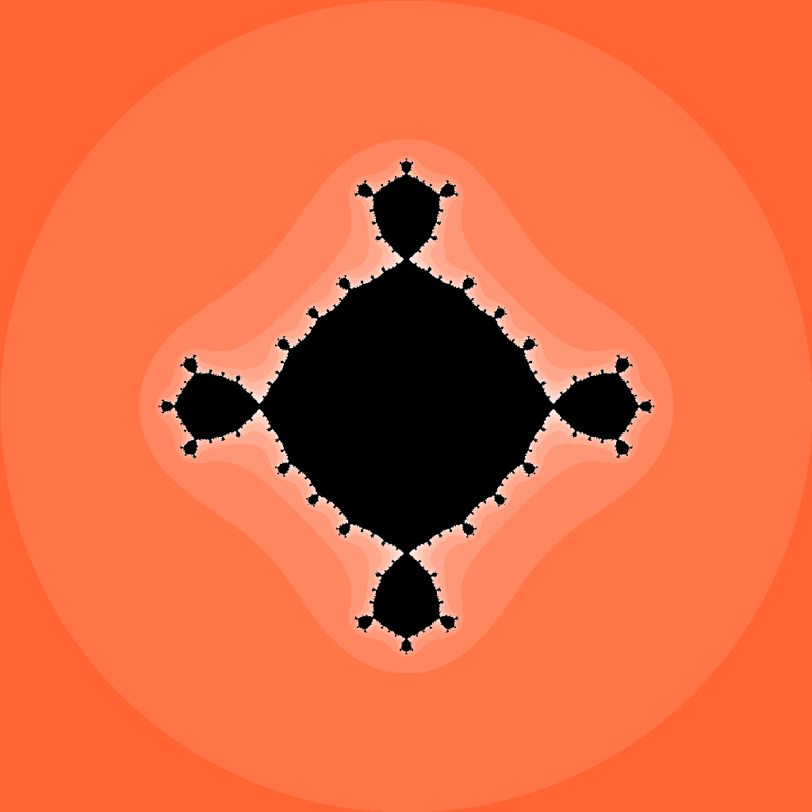

# Proyecto_1_Modelado_y_Programacion_2025-2
Repositorio para el proyecto 1 de Modelado y Programación del semestre 2025-2

**Profesor : L. en C.C. Francisco Alejandro Arganis Ramírez**

**Ayudante Teoria : Jesús Haans López Hérnandez**

**Ayudante Laboratorio : Eric Toporek Coca**


# **Proyecto 1: Graficación de fractales**

## **1. Introducción**  
Los fractales son estructuras matemáticas con propiedades autosimilares que surgen de iteraciones complejas. En este proyecto, exploraremos la generación de fractales a partir de **polinomios complejos** utilizando **Programación Orientada a Objetos (POO)**.  

Implementaremos un programa que:
- Procesará polinomios definidos en el plano complejo.
- Iterará sobre cada punto del plano para evaluar su convergencia o divergencia.
- Generará una imagen en formato `PNG` o `JPG` que represente el fractal resultante.

## **2. Objetivos**  
Este proyecto tiene como objetivos:
- Modelar un polinomio complejo y su evaluación iterativa.  
- Implementar una arquitectura basada en **POO** para encapsular los elementos del programa.
- leer un archivo de entrada con los parámetros necesarios para generar el fractal.
- Generar una imagen que represente el fractal resultante.

## **3. Formato del Archivo de Entrada**  
Para que el programa pueda generar correctamente el fractal, se utilizará un archivo de entrada con los parámetros necesarios. Este archivo tendrá un formato de texto **(input)** estructurado con los siguientes valores:  

```
width : 1024                            // Ancho de la imagen
height : 1024                           // Alto de la imagen
degree : 2                              // Grado del polinomio
polynomial : (1+0i)x^2+(-1+0i)          // Polinomio complejo
min : -2-2i                             // Valor mínimo del plano complejo
max : 2+2i                              // Valor máximo del plano complejo
iterations : 256                        // Número máximo de iteraciones
threshold : 2                           // Umbral de convergencia
color : (255,100,50)                    // Color base del fractal
nombre : fractal.png                    // Nombre del archivo de salida
```


## **4. Representación Matemática del Fractal**  
Cada punto $( z_0 )$ en el plano complejo sigue la iteración:  

$$
z_{n+1} = P(z_n)
$$

donde $P(z)$ es el polinomio evaluado. Dependiendo del comportamiento de la sucesión resultante, se define si el punto **converge** o **diverge**:

- **Convergencia:** Si la sucesión se mantiene dentro de un radio acotado, es decir, $|z_n|$ permanece dentro del umbral definido, el punto se considera **parte del fractal** y se colorea con tonos oscuros o específicos para la estabilidad.  
- **Divergencia:** Si $|z_n|$ supera el umbral después de un número finito de iteraciones (hasta 256 como máximo), se considera que el punto **escapa al infinito**, y su color se asigna según la rapidez con la que lo hace.  

El valor de **n** en la iteración puede estar en el rango de **1 a 256**, lo que significa que cada punto del plano complejo se evaluará hasta un máximo de 256 iteraciones antes de determinar si pertenece o no al conjunto del fractal.  

## **5. Conversión de Coordenadas de Píxeles a Números Complejos**
Cada píxel de la imagen representa un punto en el **plano complejo**, el cual se define entre `min` y `max` en el archivo de entrada.

La conversión se hace con las siguientes fórmulas:

$$
\text{real} = \text{min.real} + \left( \frac{x}{\text{width}} \right) \times (\text{max.real} - \text{min.real})
$$

$$
\text{imag} = \text{min.imag} + \left( \frac{y}{\text{height}} \right) \times (\text{max.imag} - \text{min.imag})
$$

Ejemplo completo:
- **Archivo de entrada:**
  ```
  min : -2-2i
  max : 2+2i
  width : 1024
  height : 1024
  degree : 2
  polynomial : (1+0i)x^2+(-1+0i)
  iterations : 256
  threshold : 2
  color : (255,100,50)
  nombre : fractal.png
  ```
- **Para el píxel (512,768):**
  - $\text{real} = -2 + \left( \frac{512}{1024} \right) \times 4 = 0$
  - $\text{imag} = -2 + \left( \frac{768}{1024} \right) \times 4 = 1$
  - Píxel representa el punto complejo **\( 0 + 1i \)**

**Iteraciones del polinomio:**
  - $z_0 = 0 + 1i$
  - $z_1 = (1 + 0i)(z_0)^2 + (-1+0i) = (1 + 0i)(-1) - 1 = - 1 - 1 = -2 + 0i$
  - $z_2 = (-1 + 0i)(z_1)^2 - 1 = (-1 + 0i)(2)^2 - 1 = (-1 + 0i)(4) - 1 = -4 - 1 = -5 + 0i$
  - como $|z_2| = 5 > 2$, el punto **diverge**

**Color resultante:**
  - Como el punto diverge, se asigna un color según la rapidez con la que lo hace.
  - En este caso, el color se asigna según el número de iteraciones necesarias para diverger.
  - Si el punto diverge en la iteración 3, se asigna un color más claro que si diverge en la iteración 10.

**Nota:** el factor para calcular la velocidad con la que diverge podria ser.

$$
\text{color final} = \left( \frac{\text{iteración}}{\text{iteraciones}} \right) \times \text{color inicial}
$$

Esta conversión es clave para evaluar cada píxel en la generación del fractal.

## **6. archivos de salida**
El programa deberá generar un archivo de salida en formato `PNG` o `JPG` que represente el fractal resultante. La imagen deberá tener las dimensiones especificadas en el archivo de entrada y los colores asignados según la convergencia o divergencia de los puntos en el plano complejo.

Estos son algunos ejemplos de fractales generados con polinomios complejos:

```
width : 1024
height : 1024
iterations : 10
threshold : 2
min : -2-2i
max : 2+2i
polynomial : (1+0i)x^2+(-1+0i)
nombre : fractal.png
color : (255,100,50)
  ```


```
width : 1024
height : 1024
iterations : 10
threshold : 2
min : -2-2i
max : 2+2i
polynomial : (1+0i)x^3+(-1+0i)
nombre : fractal1.png
color : (255,100,50)
  ```


```
width : 1024
height : 1024
iterations : 10
threshold : 2
min : -2-2i
max : 2+2i
polynomial : (1+0i)x^4+(-1+0i)
nombre : fractal2.png
color : (255,100,50)
  ```




## **6. Implementación**  
Los estudiantes deberán implementar las clases necesarias para modelar el problema y probar distintos polinomios complejos para generar fractales variados. El código deberá ser:  
- **Modular y bien documentado.**  
- **Usar las buenas practicas de código límpio.**
- **Manejar excepciones y errores.**
- **Usar las caracteristicas de la programación orientada a objetos.**
- **Eficiente en la generación de fractales.** 
- **Capaz de procesar correctamente la entrada de parámetros.**  
- **Eficiente en la iteración y evaluación de polinomios.**
- **Tener un modulo de pruebas unitarias.**
- **Tener al menos una prueba unitaria por cada método publico de las clases.**

